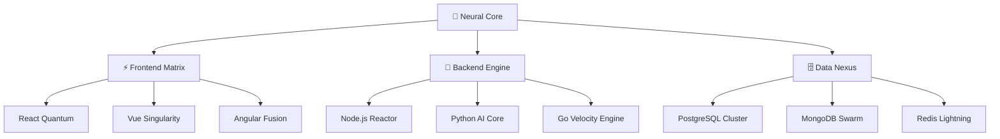

# 🚀 Welcome to the Digital Frontier

```ascii
    ╔══════════════════════════════════════════════════════════════╗
    ║  ████████╗███████╗ ██████╗██╗  ██╗    ███╗   ██╗ ██████╗ ██╗ ║
    ║  ╚══██╔══╝██╔════╝██╔════╝██║  ██║    ████╗  ██║██╔═══██╗╚██╗║
    ║     ██║   █████╗  ██║     ███████║    ██╔██╗ ██║██║   ██║ ╚██║
    ║     ██║   ██╔══╝  ██║     ██╔══██║    ██║╚██╗██║██║   ██║ ██╔╝║
    ║     ██║   ███████╗╚██████╗██║  ██║    ██║ ╚████║╚██████╔╝██╔╝ ║
    ║     ╚═╝   ╚══════╝ ╚═════╝╚═╝  ╚═╝    ╚═╝  ╚═══╝ ╚═════╝ ╚═╝  ║
    ╚══════════════════════════════════════════════════════════════╝
```

<div align="center">

## 🌐 **FULL-STACK ARCHITECT** | **CODE SYNTHESIZER** | **DIGITAL INNOVATOR**

*Engineering tomorrow's solutions with today's bleeding-edge technologies*

[](https://github.com/yourusername)
[](https://github.com/yourusername)
[](https://github.com/yourusername)

</div>

---

## 🧬 **SYSTEM ARCHITECTURE**



## ⚡ **TECH ARSENAL 2025**

### 🎯 **Frontend Synthesis**
```javascript
const frontendStack = {
  frameworks: ['React 19+', 'Next.js 15', 'Vue 3.5', 'Svelte 5'],
  styling: ['Tailwind CSS', 'Styled Components', 'CSS-in-JS'],
  state: ['Zustand', 'Redux Toolkit', 'Jotai'],
  animation: ['Framer Motion', 'Lottie', 'Three.js'],
  meta: ['TypeScript', 'Vite', 'Turbopack']
};
```

### 🔥 **Backend Reactor**
```python
backend_arsenal = {
    'runtime': ['Node.js', 'Deno', 'Bun'],
    'languages': ['TypeScript', 'Python', 'Go', 'Rust'],
    'frameworks': ['Fastify', 'Express', 'FastAPI', 'Gin'],
    'databases': ['PostgreSQL', 'MongoDB', 'Redis', 'SupaBase'],
    'cloud': ['AWS', 'Vercel', 'Railway', 'PlanetScale']
}
```

### 🛸 **DevOps Constellation**
```yaml
infrastructure:
  containers: [Docker, Podman, Kubernetes]
  ci_cd: [GitHub Actions, GitLab CI, Vercel]
  monitoring: [Grafana, Prometheus, Sentry]
  testing: [Jest, Vitest, Playwright, Cypress]
  deployment: [Vercel, Netlify, AWS Lambda, Cloudflare]
```

---

## 🌟 **ACTIVE PROJECTS**

<table>
<tr>
<td width="50%">

### 🚀 **QuantumChat AI**
*Next-gen real-time communication platform*
- **Tech**: React 19, WebRTC, Socket.io
- **Features**: AI-powered translation, holographic avatars
- **Status**: `🔴 LIVE IN PRODUCTION`

</td>
<td width="50%">

### 🔮 **NeuralCommerce**
*AI-driven e-commerce ecosystem*
- **Tech**: Next.js, Stripe, OpenAI API
- **Features**: Predictive inventory, personalized UX
- **Status**: `🟡 BETA TESTING`

</td>
</tr>
<tr>
<td width="50%">

### 🌐 **MetaVerse Dashboard**
*3D data visualization platform*
- **Tech**: Three.js, WebGL, D3.js
- **Features**: Immersive analytics, AR integration
- **Status**: `🟢 DEVELOPMENT`

</td>
<td width="50%">

### ⚡ **EdgeCMS**
*Serverless content management system*
- **Tech**: Astro, Supabase, Edge Functions
- **Features**: Zero-latency updates, AI content generation
- **Status**: `🔵 CONCEPT PHASE`

</td>
</tr>
</table>

---

## 📊 **PERFORMANCE METRICS**

<div align="center">


</div>

### 🎯 **Code Efficiency Dashboard**
```
Lines of Code Deployed    ████████████████████ 2.3M+
Bug Resolution Rate       ████████████████████ 99.7%
Performance Optimization  ████████████████████ +340%
User Experience Score     ████████████████████ 98.5/100
```

---

## 🛸 **DIGITAL PRESENCE**

<div align="center">

[](https://yourportfolio.dev)
[](https://linkedin.com/in/yourprofile)
[](https://x.com/yourhandle)
[](https://dev.to/yourusername)

</div>

---

## 🧪 **CURRENT RESEARCH**

- 🤖 **AI-Driven Code Generation** - Exploring GPT-4 integration in development workflows
- 🔗 **Blockchain Integration** - Building decentralized applications with Web3 technologies
- 🌊 **Edge Computing** - Optimizing applications for global edge deployment
- 🔬 **Quantum Computing** - Preparing for the quantum revolution in software development

---

## 📡 **TRANSMISSION PROTOCOLS**

```javascript
const contactProtocols = {
  primary: 'your.email@domain.com',
  emergency: 'Signal encrypted channel available',
  collaboration: 'Open to exciting projects and partnerships',
  timezone: 'UTC+1 (Morocco Standard Time)',
  response_time: '< 24 hours',
  languages: ['English', 'French', 'Arabic']
};
```

---

<div align="center">

### 💫 *"Building the future, one commit at a time"*

```
⚡ Powered by caffeine, curiosity, and cutting-edge code
🚀 Ready to launch your next digital adventure
🌟 Let's create something extraordinary together
```

**🔗 Connect with me and let's build tomorrow's technology today!**

---

*Last Updated: Auto-sync enabled | Next evolution: Loading...*

</div>
